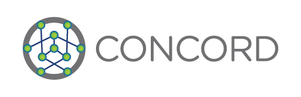

# Concord-BFT: a Distributed Trust Infrastructure

[](https://opensource.org/licenses/Apache-2.0)


<!--  -->

<!--  -->


Overview
----
Project Concord is a highly scalable and energy-efficient distributed trust infrastructure for consensus and smart contract execution.

concord-bft
----


The core engine of project Concord is concord-bft, a generic state machine replication library that can handle malicious (byzantine) replicas.
This library is designed to be used as a core building block for replicated distributed data stores, and is especially suited to serve as the basis of permissioned Blockchain systems.
Its implementation is based on the algorithm described in the paper [SBFT: a Scalable Decentralized Trust Infrastructure for
Blockchains](https://arxiv.org/pdf/1804.01626.pdf).

Releases
----

 [v0.5](https://github.com/vmware/concord-bft/releases/tag/v0.5)


Roadmap
----
We plan to release updates in a quarterly schedule. The next releases will include: optimized State transfer modules with rocksdb integration, configuration and key generation tools, generic key-value interface, and execution engine for EVM smart contracts. We also plan to support Windows, OS X, and additional Linux distributions.


Contributing
----

The concord-bft project team welcomes contributions from the community. If you wish to contribute code and you have not
signed our contributor license agreement (CLA), our bot will update the issue when you open a Pull Request. For any
questions about the CLA process, please refer to our [FAQ](https://cla.vmware.com/faq). For more detailed information,
refer to [CONTRIBUTING.md](CONTRIBUTING.md).

Community
----

[Concord-BFT Slack](https://concordbft.slack.com/).

Get Slack invitation via this [link](https://join.slack.com/t/concordbft/shared_invite/enQtNTAyMzg0MTk0NzU0LWViMjA4ODQ4OTcxYmVkMWU4NGYyNTZmZDQ0ZTIzZTNiZmIyZmI5Mjg0NDZjNjBkYmI2Yjg1Mzg1NGUyNjQ0OWQ) or send request to <concordbft@gmail.com>.


Directory structure
----

- [bftengine](./bftengine): concord-bft codebase
	- [include](./bftengine/include): external interfaces of concord-bft (to be used by client applications)
	- [src](./bftengine/src): internal implementation of concord-bft
    - [tests](./bftengine/tests): tests and usage examples
- [threshsign](./threshsign): crypto library that supports digital threshold signatures
	- [include](./threshsign/include): external interfaces of threshsign (to be used by client applications)
	- [src](./threshsign/src): internal implementation of threshsign
    - [tests](./threshsign/tests): tests and usage examples
- [scripts](./scripts): build scripts


License
----

concord-bft is available under the [Apache 2 license](LICENSE).


Build (Ubuntu Linux 18.04)
----
### Dependencies

CMake and clang:

    sudo apt-get install cmake clang clang-format

Get GMP (dependency for [RELIC](https://github.com/relic-toolkit/relic)):

    sudo apt-get install libgmp3-dev

Build and install [RELIC](https://github.com/relic-toolkit/relic)

    cd
    git clone https://github.com/relic-toolkit/relic
    cd relic/
    git checkout b984e901ba78c83ea4093ea96addd13628c8c2d0
    mkdir -p build/
    cd build/
    cmake -DCMAKE_BUILD_TYPE=RelWithDebInfo -DALLOC=AUTO -DWSIZE=64 -DRAND=UDEV -DSHLIB=ON -DSTLIB=ON -DSTBIN=OFF -DTIMER=HREAL -DCHECK=on -DVERBS=on -DARITH=x64-asm-254 -DFP_PRIME=254 -DFP_METHD="INTEG;INTEG;INTEG;MONTY;LOWER;SLIDE" -DCOMP="-O3 -funroll-loops -fomit-frame-pointer -finline-small-functions -march=native -mtune=native" -DFP_PMERS=off -DFP_QNRES=on -DFPX_METHD="INTEG;INTEG;LAZYR" -DPP_METHD="LAZYR;OATEP" ..
    make
    sudo make install

Build and install [cryptopp](https://github.com/weidai11/cryptopp)

    cd
    git clone https://github.com/weidai11/cryptopp.git
    cd cryptopp/
    git checkout CRYPTOPP_5_6_5;
    mkdir build/
    cd build/
    cmake ..
    make
    sudo make install

Get GNU Parallel

    sudo apt-get install parallel

Get g++:

    sudo apt-get install g++

#### (Optional) Use log4cplus

We have simple console logger but if you wish to use log4cplus - we have an
infra that supports it.

Follow below steps for installing this library:
1. Install prerequisites:

```
    sudo apt-get install autoconf automake
```

2. Clone the repository:

```
    git clone https://github.com/log4cplus/log4cplus.git
```

3. Move to the extracted directory and checkout the appropriate branch:

```
    cd log4cplus
    git checkout REL_1_2_1
```

4. Edit `configure` to change "am__api_version" from 1.14 to 1.15, the
version that ubuntu 16.04 supports.

5. Configure/make/install

```
    ./configure CXXFLAGS="--std=c++11"
    make
    sudo make install
```

Configuring with these flags is important. If log4cplus is build without `c++11` then athena will give linker errors while building.

At this point all library files and header files should be installed into `/usr/local`. (You may need to add `/usr/local/lib` to your `LD_LIBRARY_PATH`).
You may also need to export CPLUS_INCLUDE_PATH variable set to /usr/local/include for the header files.

After installation, set USE_LOG4CPP flag to TRUE in the main CmakeLists.txt . The library doesn't initialize the log4cpp subsystem, including formats and appenders, it expects that the upper level application will do it and the log4cpp subsystem is already initialized.

#### (Optional) If you want to use Python test script
Install Python 3

    sudo apt-get update
    sudo apt-get install python3

After the installation, please verify the version by running:

    python3 --version

It should be

    Python 3.x.x

#### (Optional) Only if using TLS as communication module
We use OpenSSL for TLS communication module. Please install it using

    sudo apt-get install openssl libssl-dev

#### (Optional) Only if using TLS or plain TCP as communication module
We use Boost both for plain TCP and TLS communication. Please follow these
instructions to install this library

Download Boost version 1.64

    wget https://dl.bintray.com/boostorg/release/1.64.0/source/boost_1_64_0.tar.gz

Unpack the archive

    tar -xf boost_1_64_0.tar.gz

Build and install Boost (note that these commands will install only modules
that are mandatory for building this project)

    cd boost_1_64_0
    ./bootstrap.sh --with-libraries=system,filesystem
    ./b2
    sudo ./b2 install

### Select comm module
We support both UDP and TCP communication. UDP is the default. In order to
enable TCP communication, build with `-DBUILD_COMM_TCP_PLAIN=TRUE` in the cmake
instructions shown below.  If set, the test client will run using TCP. If you
wish to use TCP in your application, you need to build the TCP module as
mentioned above and then create the communication object using CommFactory and
passing PlainTcpConfig object to it.

We also support TCP over TLS communication. To enable it, change the
`BUILD_COMM_TCP_TLS` flag to `TRUE` in the main CMakeLists.txt file. When
running simpleTest using the testReplicasAndClient.sh - there is no need to create TLS certificates manually. The script will use the `create_tls_certs.sh` (located under the scripts/linux folder) to create certificates. The latter can be used to create TLS files for any number of replicas, e.g. when extending existing tests.


### Build concord-bft

Create a build directory and enter it:

    cd
    mkdir -p concord-bft/build
    cd concord-bft/build

To perform a default build execute the following:

    cmake ..
    make

In order to turn on or off various options, you need to change your cmake configuration. This is
done by passing arguments to cmake with a `-D` prefix: e.g. `cmake -DBUILD_TESTING=OFF`. Note that
make must be run afterwards to build according to the configuration. The following options are
useful for building concord-bft:

 * `CMAKE_BUILD_TYPE`     - Debug | Release | RelWithDebInfo | MinSizeRel (DEFAULT Debug)
 * `BUILD_TESTING`        - OFF | ON  (DEFAULT ON)
 * `BUILD_COMM_TCP_PLAIN` - TRUE | FALSE (DEFAULT FALSE - UDP is used)
 * `BUILD_COMM_TCP_TLS`   - TRUE | FALSE (DEFAULT FALSE - UDP is used)
 * `USE_LOG4CPP`          - TRUE | FALSE (DEFAULT FALSE)
 * `CONCORD_LOGGER_NAME`  - STRING (DEFAULT "concord")

 Note: You can't set both `BUILD_COMM_TCP_PLAIN` and `BUILD_COMM_TCP_TLS` to TRUE.

### (Optional) Python client

The python client is required for running tests. If you do not want to install
python, you can configure the build of concord-bft by running `cmake
-DBUILD_TESTING=OFF ..` from the `build` directory.

The python client requires python3(>= 3.5) and trio, which is installed via pip.

    sudo apt install python3 python3-pip
    python3 -m pip install --upgrade trio

Run examples
----

### Simple test application (4 replicas and 1 client on a single machine)

Tests are compiled into in the build directory and can be run from anywhere as
long as they aren't moved.

Run the following from the top level concord-bft directory:

   ./build/bftengine/tests/simpleTest/scripts/testReplicasAndClient.sh

Alternatively you can run `runReplicas.sh` and `runClient.sh` from the same
directory as `testReplicasAndClient.sh`.

### Using simple test application via Python script

You can use the simpleTest.py script to run various configurations via a simple
command line interface.
Please find more information [here](bftengine/tests/simpleTest/README.md)
