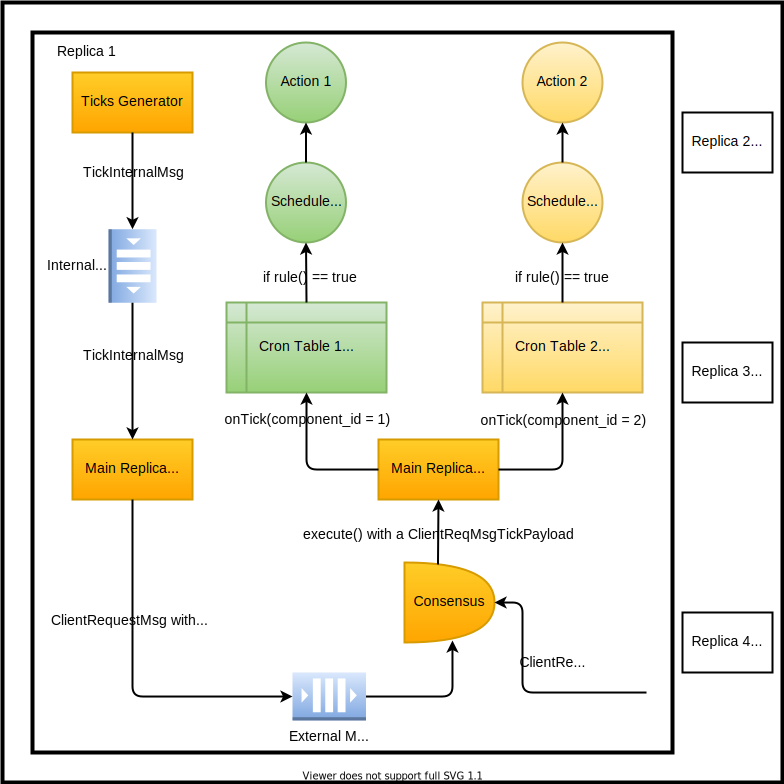

# Introduction

Out of the box, Concord is an event driven system. It only does work when a client request is received.
However, automatically executing periodic actions or scheculing future work is an useful feature for any
computer system. Therefore, we are introducing **Concord Cron (ccron)** - a job scheduler, modelled after
the traditional [Unix cron](https://en.wikipedia.org/wiki/Cron).

# Cron in a Distributed System
Concord is a distributed system that consists of a number of replicas. One of its most important features
is that it guarantees all replicas have the same state. This is done by replicating a deterministic state
machine (State Machine Replication). If we feed a deterministic state machine with a certain log of commands,
it will always produce the same output and end state. Combining that with a consensus mechanism that makes
sure the log of commands is exactly the same across replicas (state machine instances), we can guarantee the
state across replicas is the same.

Based on above, we want that cron table entries are executed in the exact same order relative to both
other cron entries and client requests. We achieve that by introducing **Ticks** - a normal write client request
message that goes through consensus, is ordered relative to user client requests and, essentially,
triggers the cron table.

Ticks are generated by **all** replicas, ensuring liveness even in case some replicas are down or are malicious.
Furthermore, triggering the cron table via ticks allows it to operate even if there is no user traffic in the system.
Reducing the number of ticks is discussed in [Future Work](#future-work).

An overview of the system is shown on the following diagram:



# Concord Cron Table
ccron supports multiple cron tables of the form shown below:

| Position   | Rule              | Action               | opt Schedule Next  | opt On Remove |
| :---------:|:------------------| :--------------------| :------------------| :-------------|
| 0          | true              | prune                | nullopt            | nullopt       |
| 1          | now >= next ?     | run smart contract X | next = now + 5 min | remove next   |
| 2          | BFT seq >= next ? | run smart contract Y | next = seq + N     | remove next   |

A cron table consists of an ordered list of entries. Entries are evaluated in order and contain the following:
 * Rule - a C++ function that returns true if the Action must be executed or false otherwise.
 * Action - a C++ function that executes an application-specific action.
 * opt Schedule Next - an optional C++ function that can be used to schedule (or persist) the next execution.
   Schedule Next is only executed if Rule returns true.
 * opt On Remove - an optional C++ function that can be called when removing a cron table entry. Can be useful
   if Schedule Next has persisted any data and we want to remove it when the entry is no longer used.

The C++ signatures for the functions are:
```C++
using Rule = std::function<bool(const Tick&)>;
using Action = std::function<void(const Tick&)>;
using ScheduleNext = std::function<void(const Tick&)>;
using OnRemove = std::function<void(std::uint32_t)>;
```

The Cron table and entries are implemented in:
* [cron_table.hpp](include/ccron/cron_table.hpp)
* [cron_entry.hpp](include/ccron/cron_entry.hpp)

As mentioned, ccron supports multiple cron tables. In order to discriminate between them, we provide a cron table
registry that is indexed by a **component_id**:
[CronTableRegistry](include/ccron/cron_table_registry.hpp)

A component can be any part of the system that requires scheduling jobs. Furthermore, ticks themselves are per component
and, currently, contain the following data:
[tick.hpp](include/ccron/tick.hpp)
```C++
// Represents a tick that is passed to the cron table and its entries.
struct Tick {
  // The component ID this tick is for.
  std::uint32_t component_id{0};

  // The BFT sequence number of this tick.
  std::uint64_t bft_sequence_num{0};

  // Time that is the same across replicas after being agreed upon.
  // It is optional as the time service that provides agreement across replicas is itself optional.
  std::optional<std::chrono::milliseconds> ms_since_epoch;
};
```
It is important to note that the Rule, Action and Schedule Next functions receive a **Tick** and can base their
behaviour on the information inside of it.

Another thing to note is that the provided time in the tick is the time agreed upon between replicas. Therefore,
it is deterministic and is the same across all replicas. Furthermore, the time service providing agreement across
replicas is itself optional - if it is not enabled, the tick time will be nullopt.

## Periodic Action Entry Factory
A factory function for generating a periodic action cron table entry is provided. It makes use of reserved pages,
making sure that the correct schedule is maintained even in case of restarts/crashes. Furthermore, the schedule
is synced between replicas during State Transfer.

A thing to note is that periodic actions depend on time and will never be executed if the time service is disabled.

Implementation:
[periodic_action.cpp](src/periodic_action.cpp)

## Multithreading Considerations
Concord uses a single replica messaging thread that executes client requests (ticks included) in a specific order.
Therefore, the cron table assumes that it will be called from one thread only and doesn't make any provisions
for calling it otherwise. Moreover, the user-supplied cron entry functions are also called in the single replica
messaging thread.

# Ticks Generator
Every replica has a single ticks generator that generates ticks for all registered components. Users of the class
can start ticks generation with a given period and can also stop it.

A thing to note is that the ticks generator's period only determines the granularity of time-based cron table triggers
and not the actual frequency at which a certain cron action is called - that is dependent on the given rule for the
cron entry.

In terms of implementation, the ticks generator runs a single thread in the background that wakes up every `poll_period`
seconds and checks which ticks are pending for generation.

Implementation:
[TicksGenerator](include/ccron/ticks_generator.hpp)

## Throttling Ticks
Since the ticks generator is just a thread generating ticks without any indication as to how many pending
ticks there are, there can be a situation with a lot of pending ticks that are going to time out and trigger an
unneccessary view change. In order to avoid that, we limit the amount of pending ticks per component in a single
replica to 1.

A tick can be pending in either of the following two places:
* the external message queue [IncomingMsgsStorageImp](../bftengine/src/bftengine/IncomingMsgsStorageImp.cpp)
* the [ClientsManager](../bftengine/src/bftengine/ClientsManager.cpp)

However, checking whether there is a pending tick in both of them from the generator thread is not trivial,
because multiple other threads are accessing the external message queue and the replica messaging thread is the only one accessing the ClientsManager.
Adding locks can solve that problem, but will make the code more complicated. Instead, we would like to only add/remove/check
pending ticks from the replica messaging thread. To achieve that, we introduce the [TickInternalMsg](../bftengine/src/bftengine/messages/TickInternalMsg.hpp)
that is sent as an internal message to the replica messaging thread. Then, the replica messaging thread just dispatches it back to
`TicksGenerator::onInternalTick(const bftEngine::impl::TickInternalMsg&)`. If there is no pending tick for the
component in question, that method creates a `ClientRequestMsg`, containing a CMF `ClientReqMsgTickPayload` payload
and pushes it to the back of the replica external queue, as if received from the network. Otherwise, if there is a
pending tick for the component in question, the tick is ignored.

In terms of checking if there is a pending tick per component in the ClientsManager, the ticks generator maintains a
map of latest pending tick request sequence numbers per component ID. That way, when a tick for a specific component ID is
generated, it can be checked with its latest request sequence number (from the map) in the ClientsManager.

Checking if there is a pending tick in the external message queue is achieved by the ticks generator maintaining a set of
component IDs that have ticks pending in that queue. When a tick is consumed from the external message queue by the replica messaging
thread, the `TicksGenerator::onTickPoppedFromExtQueue(std::uint32_t component_id)` method is called as a callback and the component
ID in question is removed from the set.

To illustrate, below we are showing the path of a tick in the system (taken from a comment in
[TicksGenerator](src/ticks_generator.cpp) for convenience):
```
// -----------------------------------------------------------------------------------------------------------
//                                                         onTickPoppedFromExtQueue()
//                                                                    |
//                                                                    v
//  ticks gen -> internal queue -> onInternalTick() -> external queue -> onMessage() -> consensus -> execute()
//                                                                            ^
//                                                                            |
//                                                             ClientsManager::addPendingRequest()
// -----------------------------------------------------------------------------------------------------------
```

Finally, throttling ticks should not have an impact on the cron table, because if there is a pending tick, it should be
processed at some point. If not, a subsequent tick will eventually be processed. Moreover, what time an action
is executed at is dependent on data in the tick itself (such as time, BFT sequence number) and, potentially,
deterministic system state and **not** on the ticks generation frequency.

# Limitations
## Amount of Ticks
As mentioned, every replica generates ticks and that has benefits to liveness. However, it has downsides:
 * The amount of ticks is dependent on the number of replicas in the cluster.
 * The amount of ticks is more than theoretically needed. Discussed more in [Future Work](#future-work).

## Malicious Replica
A malicious replica can decide to generate a significant amount of ticks in an attempted denial of service
attack. Currently, as ticks are normal client requests, we don't have a way to avoid that. On the other hand,
any client in the system can do the same anyway. From that perspective, ccron doesn't try to solve these
problems and leaves them to separate efforts.

# Future Work
## Number of Ticks
To reduce the amount of ticks generated and still guarantee liveness, we can require only F + 1 replicas to
send ticks on every period and rotate which replicas do it deterministically.

## Support for Bigger Periodic Schedule
Since the implemented periodic action uses a single reserved page of a fixed size, that might be a limitation
for the future. Therefore, we might want to utilize multiple reserved pages in order to provide support for
more such actions.
