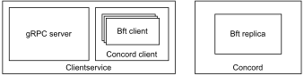

# Overview

This `client` directory contains all interfaces and libraries to interact with a "client" which talks to the replica network.
There are different interfaces to choose from:
* [Bft client](bftclient/include/bftclient/bft_client.h)
* [Concord client](concordclient/include/client/concordclient/concord_client.hpp)
* [Clientservice](proto)

The bft client is the most minimal interface and required for any messages that are send to the replica network.
Concord client is a wrapper around the bft client plus additional functionality which is left out in the picture.
It is used when Concord (the replica) is deployed because Concord implements its own logic on top of a bft replica which requires Concord-specific client messages.
At the outer-most layer, you can use Clientservice. It is a wrapper around Concord client and provides a gRPC interface.
