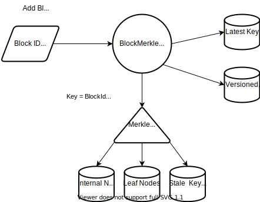
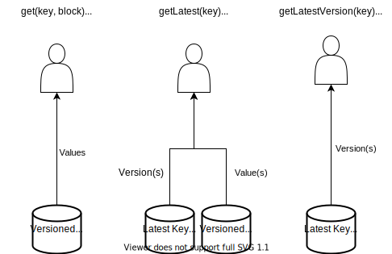

# Motivation

The ability to provide cryptographic proof that a key is present in the blockchain
was the rationale behind the introduction of the [sparse merkle
tree](https://github.com/vmware/concord-bft/tree/master/kvbc/include/sparse_merkle). The
expectation was that all keys would live in one or more merkle trees and each would be provable
directly via a [merkle
proof](https://medium.com/crypto-0-nite/merkle-proofs-explained-6dd429623dc5#:~:text=Merkle%20proofs%20are%20established%20by,can%2Fshould%20be%20the%20same.).
Unfortunately, we quickly discovered that the overhead in terms storage size, IO, and computation prevented us from hitting our performance goals.

Through proof of concept work and benchmarking we realized that by drastically reducing the number of keys stored in the merkle tree, we could achieve our performance goals of writing **1k 25kb transactions/s**. We were able to achieve this by result by batching multiple transactions consisting of many K/V pairs at the KVBC level into a single block, and then only storing a single key in the merkle tree for the entire block.

# Definitions
 * **KVBC** - The key-value blockchain layer. Provides a storage abstraction for a blockchain where key-value pairs are added and deleted as part of blocks.
 * **Pruning** - Deletion of blocks and any inactive keys in those blocks
 * **Active Keys** - Keys that are part of a pruned block but are at the latest version in a system. These keys were never overwritten or deleted and therefore are available for use in current and future transactions.
 * [**VersionedKey**](https://github.com/vmware/concord-bft/blob/2394f64cf2dceb0089c0f180d6b6a893fe39b97f/kvbc/cmf/categorized_kvbc_msgs.cmf#L108-L113) - The format of the key for accessing values stored by the category. It consists of the hash of the key concatenated with the Block ID.

# Goals
 * Reduce the overhead of the merkle tree in terms of storage capacity, IO, and CPU to meet the goal of writing 1k 25kb transactions/s to the blockchain.
 * Maintain the ability to prune blocks and keys, but still reference and prove **Active** keys.
 * Maintain the ability to lookup keys directly without traversing the merkle tree
 * Provide the ability of the merkle tree to scale to large numbers of keys
 * Maintain the logical separation between the `BlockMerkle` category itself and any merkle tree implementations.

# Logical Architecture

The BlockMerkle category is composed of four functions that allow interaction with the underlying data:
 * Adding blocks composed of added and deleted keys
 * Reading keys
 * Pruning blocks and their corresponding **inactive** keys
 * Proving keys

While keys and values that compose a block are stored and accessed by `VersionedKey`, and written
when adding a block, we must necessarily write additional index data to support the other three
functions of the `BlockMerkle` category. This index data is the necessary overhead to meet the
goals for the category. We can split this index data according to function such that we can
calculate the overhead required for each purpose. This structuring allows clarity and future
optimization efforts to be targeted in the future.

Note that the overhead in the following table includes both keys and values

| Index                               | Functions        | Creation Point                   | Size overhead                                       | Purpose                                                                                                         |
| ----------------------------------- | ---------------- | -------------------------------- | --------------------------------------------------- | --------------------------------------------------------------------------------------------------------------- |
| Latest Key Version                  | Reading, Pruning | Add Block                        | 40 bytes                                            | Direct lookup of the latest key. Retrieval of latest versions only for conflict detection.                      |
| Merkle Internal Nodes               | Proving          | Add Block , Delete Genesis Block | 128 - 1820 bytes                                    | Walking the merkle tree.                                                                                        |
| Merkle Leaf Nodes                   | Proving          | Add Block, Delete Genesis Block  | 72                                                  | Retrieve root data hash for proofs.                                                                             |
| Merkle Stale Keys                   | Pruning          | Add Block, Delete Genesis Block  | 4 + Num Internal Keys *(17-53) + Num Leaf Keys * 44 | Garbage collection of unreachable nodes.                                                                        |
| Pruned BlockId by Active Key Hash   | Pruning          | Delete Genesis Block             | 40                                                  | Garbage collection of overwritten or deleted active keys.                                                       |
| Active Key Hashes by Pruned BlockId | Proving, Pruning | Delete Genesis Block             | 12 + 32 * Num active keys in block                  | Generate root data hash to prove active keys. Garbage collect blocks in merkle tree when no active keys remain. |


While this doc has only so far discussed logical data, and will continue to mostly do so, it should be noted that each index and the key-value storage itself is implemented in a separate RocksDB column family. To simplify things we will refer to each column family as a table.

## Adding a Block

When we add a block we write added KV pairs to by creating a [VersionedKey](https://github.com/vmware/concord-bft/blob/2394f64cf2dceb0089c0f180d6b6a893fe39b97f/kvbc/cmf/categorized_kvbc_msgs.cmf#L108-L113) and writing the raw value by versioned key to the `Keys` table. We also write the BlockId for all added keys by hash to the `LatestKeyVersions` table. For deletes, we do write the BlockId but with the high bit set to indicate a tombstone to the `LatestKeyVersions` table. Old versions are only garbage collected during pruning.

Since there are many keys in a block, and we want them to be provable, we do the simplest thing possible to facilitate that. We essentially create a 2 level static merkle tree by hashing the concatenations of the hashed added keys and values in order followed by the hashed deleted keys, such that we generate a `RootDataHash`:

```
h((h(k1) || h(v1)) || ... || (h(kN) || h(vN) || h(dk1) || ... || h(dkN))
```
 * `h` is a hash function (SHA3-256 in our case)
 * `kN` is the Nth added key
 * `vN` is the Nth added value
 * `dkN` is the Nth deleted key

We then take the `RootDataHash` and insert it as the value into the merkle tree using the `BlockId` as key. This generates new internal nodes (including a new root), a new leaf node, and previous nodes that have become stale as of this version of the tree. These `Stale` indexes are safe to delete when we prune this newly added block as they are no longer referenced in the tree.



## Reads

To read the value(s) of a key(s) written in a specific block the user can call the [get](https://github.com/vmware/concord-bft/blob/master/kvbc/include/categorization/block_merkle_category.h#L42-L45) or [multiGet](https://github.com/vmware/concord-bft/blob/master/kvbc/include/categorization/block_merkle_category.h#L56-L61) methods.

To read the value of the latest key(s) the user can call the [getLatest](https://github.com/vmware/concord-bft/blob/master/kvbc/include/categorization/block_merkle_category.h#L47-L49) or [multiGetLatest](https://github.com/vmware/concord-bft/blob/master/kvbc/include/categorization/block_merkle_category.h#L63-L65) methods.

Lastly, if a user only wants to retrieve the latest version of a key, they can call the [getLatestVersion](https://github.com/vmware/concord-bft/blob/master/kvbc/include/categorization/block_merkle_category.h#L63-L65) or [multiGetLatestVersion](https://github.com/vmware/concord-bft/blob/master/kvbc/include/categorization/block_merkle_category.h#L67-L71) methods. The latter is planned to be used directly for conflict detection.

All `multiGet*` methods take advantage of the native RocksDB `MultiGet` functionality which both amortizes the search cost across levels for multiple keys, but also utilizes IO_Uring on linux to provide concurrent, non-blocking storage access in a single thread. This is very powerful, as it eliminates the latency inherent in iterative disk accesses and takes advantage of modern storage technologies' inherent parallelism.

In previous versions of our code, reads were very slow, because they always used seeks to find the proper versions, and never used multiGets. Furthermore, conflict detection used not only seeks, but also retrieved the full values from RocksDB as there was no separate index containing only the versions.

Now we use only point reads, and conflict detection for many keys can be done with a single `multiGetLatestVersion` call that only returns 8 byte values for each version to the user.



# Overhead
Back of the envelope calculation for:
 * 3 Billion keys
 * 25 Kb / unbatched block
 * 30 keys / block

## Assumptions
 * We removed seeks so even the solution where all keys go into the merkle tree (v2) have latest version indexes. We therefore do not count these as overhead.
 * To simplify calculations we take `log16(NumKeys)` to determine the average depth of the tree. We then assume that all internal nodes are full and reside at that depth. In practice, some nodes will be deeper, some shallower and less full, with most of the top level nodes full. This is a reasonable approximation.
 * We use the new [CMF](https://github.com/vmware/concord-bft/blob/2394f64cf2dceb0089c0f180d6b6a893fe39b97f/kvbc/cmf/categorized_kvbc_msgs.cmf) messages for size calculation for apples/apples comparison.
 * Assume 10 stale keys per block which leads to 7 paths (conservative).
 * We taking pruning into consideration, although we can't avoid stale keys generated by the merkle tree.

## Baseline calculation - All keys in the merkle tree

 * **Size of full Internal Node** = 1820 bytes
 * **Size of Leaf Node** = 0 - its just a versioned key
 * **Depth of tree** = log16(3 Billion) = 7
 * **Size of Stale Key indexes per block** = 8 + (7 paths * 7 internal node keys / path * 17 bytes / key) + 44*10 = 1281 bytes

 * **Total Size per added block** = 1820 * 7 * 30 + 1281 = 384021 bytes
 * **Total size for 100M Blocks** = ~38 TB
 * **Overhead per block** = 384/25 = 1536%

Note that changing the block size does not change the total size.

## Block Merkle with no batching

Assume a single path as stale, since we are only adding blocks and not deleting or overwriting keys. No leaf keys ever become stale when adding blocks.

 * **Size of Leaf Node** = 72
 * **Total Number of merkle nodes** == 3 Billion / 30 = 100 Million
 * **Depth of tree** = log16(100 Million) = 6
 * **Size of Stale Key indexes per block** = 8 + 6 nodes * 16 bytes/key = 104 bytes

 * **Total size per added block** = 1820*6 + 72 + 104 = 11096 bytes
 * **Total size per 100M blocks** = 1.109 TB
 * **Overhead per block** = 11/25 = 44%

 ## Block Merkle with batch of 10 transactions / block

 * **Total Number of merkle nodes** = 3Billion / (10*30) = 10 Million
 * **Depth of tree** = log16(10 Million) = 6
 * **Size of Stale key indexes per block** = 104 bytes

 * **Total Size per added block** = 11096 bytes
 * **Total size per 10M blocks** = 110 GB
 * **Overhead per block** = 4.4%

# Better usage of RocksDB

 * Only do point queries
 * Utilize MultiGet
 * Multiple column families
 * Optimal reads for conflict detection with version indexes
 * Turn on Bloom filters
