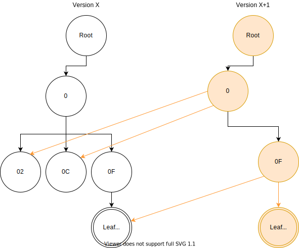
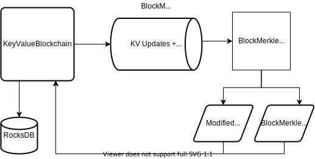
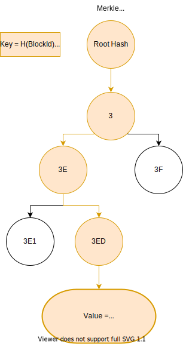
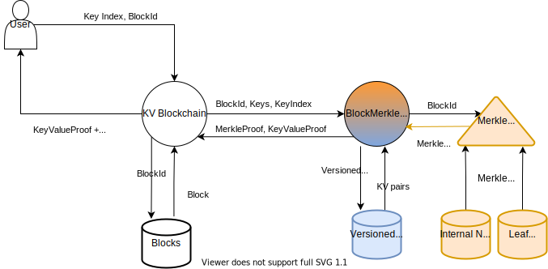
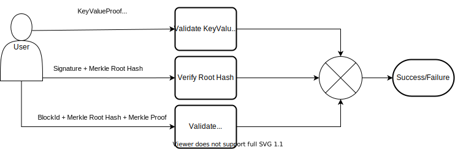
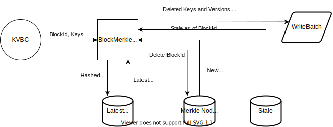
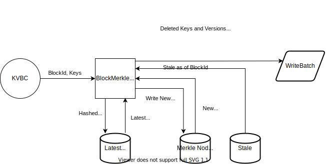
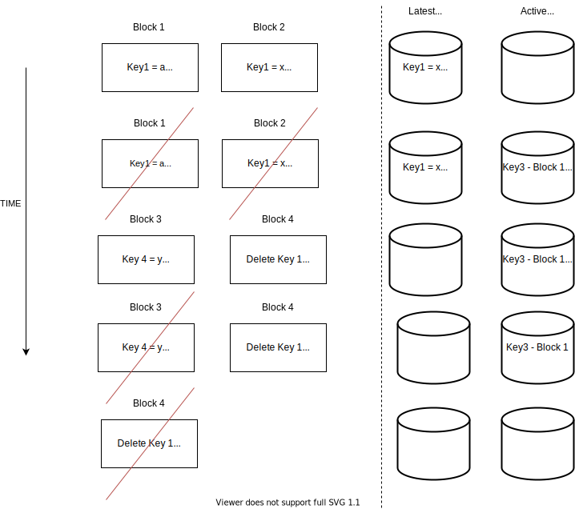
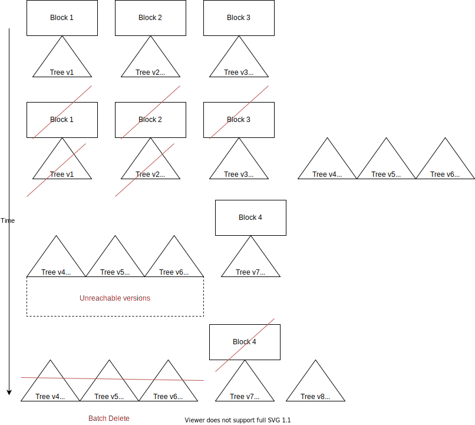

# Background

A [copy-on-write sparse merkle
tree](https://github.com/vmware/concord-bft/tree/7061695406885604471a8a7bd5944e8d16d7280f/kvbc/include/sparse_merkle)
exists as part of the key-value blockchain (KVBC) abstraction provided to users of concord-bft.
The introduction of the sparse merkle tree was intended as the default storage for **all**
key-value pairs managed by the KVBC layer, such that:
 * Any key could be looked up directly by Key And Block Version
 * A proof of existence or non-existence could be provided for any block in the system given signed root for that block.
 * Staleness of overwritten and deleted keys was automatically tracked to allow for blocks to be pruned from the beginning of the blockchain, such that any key still referenced by unpruned versions of the tree would remain accessible and provable.

While the design and implementation of the sparse merkle tree is outside the scope of this
document, a few key points are worth noting:
 * The tree is copy on write. All nodes are immutable. When keys are added to the tree, a [path-copy](https://en.wikipedia.org/wiki/Persistent_data_structure#Path_copying) is made until a new tree version with a new root is created that points to the newly created branch of the tree and all other active branches from prior versions of the tree.
 * The tree uses 4-level node batching, such that each node can be represented by a unique [Nibble Path](https://github.com/vmware/concord-bft/blob/7061695406885604471a8a7bd5944e8d16d7280f/kvbc/include/sparse_merkle/base_types.h#L237-L338) that can be walked to lookup the node in the tree from the latest root. Each internal node is therefore a 4-level tree made up of 15 internal nodes and 16 leaf nodes. These nodes may or may not be populated as shown in these [doc](https://github.com/vmware/concord-bft/blob/7061695406885604471a8a7bd5944e8d16d7280f/kvbc/include/sparse_merkle/internal_node.h#L27-L47) [comments](https://github.com/vmware/concord-bft/blob/7061695406885604471a8a7bd5944e8d16d7280f/kvbc/include/sparse_merkle/internal_node.h#L100-L165).
 * Each `BatchedInternalNode` has a [unique key](ihttps://github.com/vmware/concord-bft/blob/7061695406885604471a8a7bd5944e8d16d7280f/kvbc/include/sparse_merkle/keys.h), as does each `LeafNode`.
 * We currently use SHA3-256 as the hash algorithm. Since we use 4 level node batching, the max depth of a leaf in the tree is **64**, rather than 256.

The representative diagram below shows the key properties described above for a sparse merkle
tree made up of keys and values. A key with hash `0FA1...` is being inserted. This causes a new
path from the root to be created. The path only goes as deep as necessary. Since there are
overlapping keys at nibble path `OF`, but no deeper, the new key becomes a leaf of the tree
pointed to by batched internal node `OF`. The result is 3 new internal nodes being created at
tree version `X+1` and a new leaf node being created.

Such a persistent (copy-on-write) tree has the benefit that a user can have a signed copy of the
merkle root at version `X` and still prove that Leaf `OF1B` was part of that version of the tree.
With a mutable tree, a user could only prove that that a key is part of the latest version of the
tree. If a key is overwritten, and there is no old copy of the tree, the user cannot prove that
the prior version ever existed if only ****given**** the current root hash.

However, the mutable tree has the advantage that it requires much less storage overhead than a
persistent tree. In our persistent version, we have to rewrite a new root node, node at `0` and
node at `0F`, rather than simply updating the existing nodes. This is 3 extra
BatchedInternalNodes. In a large tree, the top level nodes will be nearly full (31 hashes +
metadata), with a full node taking up approximately 1.5kb of space. Importantly, the overhead
gets worse as more keys are inserted, rather than better. This storage overhead is expensive, and
it also significantly impacts performance as much more data is read and written than if the keys
and values were simply stored alone.

What is needed is a way to get the bulk of the benefits of the sparse merkle tree, while limiting
the overhead. The solution should also scale well: more keys should not cause overhead to
increase significantly. Our solution is to reuse the sparse merkle tree, but to only store
per-block data, rather than per-key data. The more keys we batch into a block, the lower the
overhead of the merkle tree.

The block based usage of the sparse merkle tree is part of a process of **storage
categorization** in KVBC, where different keys can be stored in different **categories**, with
each category providing different guarantees. The work described here is part of the
`BlockMerkle` category.

Categorization in general, and other key categories, in particular, are out of scope for this
document. It is still worth being aware that this is just one of many ways to store data in KVBC.
Users of concord-bft do not have to use the `BlockMerkle` category, nor do they have to use KVBC
at all. The goals and assumptions below are justifications for when a user may want to consider
using the `BlockMerkle` category.

# Design

The `BlockMerkle` category is a storage adapter for blockchain based applications that use the
key categorization interfaces of KVBC. As such, it only *uses* the sparse merkle tree. It also
implements the
[`IDBReader`](https://github.com/vmware/concord-bft/blob/7061695406885604471a8a7bd5944e8d16d7280f/kvbc/include/categorization/block_merkle_category.h#L176-L199)
interface that the sparse merkle tree requires to lookup nodes from a specific database. The
`BlockMerkle` category utilizes RocksDB as the underlying storage mechanism, and in particular
heavily uses [column families](https://github.com/facebook/rocksdb/wiki/Column-Families),
[MultiGet](https://github.com/facebook/rocksdb/wiki/MultiGet-Performance), and atomic
[WriteBatch](https://github.com/facebook/rocksdb/wiki/Basic-Operations#atomic-updates)
functionalities.

The underlying [storage
schema](https://github.com/vmware/concord-bft/blob/7061695406885604471a8a7bd5944e8d16d7280f/kvbc/cmf/categorized_kvbc_msgs.cmf) is
defined using [Concord Message Format
(CMF)](https://github.com/vmware/concord-bft/tree/7061695406885604471a8a7bd5944e8d16d7280f/messages).

The `BlockMerkle` category separates **keys** and **blocks** logically and physically. Each block
is represented as a
[BlockMerkleInput](https://github.com/vmware/concord-bft/blob/7061695406885604471a8a7bd5944e8d16d7280f/kvbc/cmf/categorized_kvbc_msgs.cmf#L3-L6)
when [adding a
block](https://github.com/vmware/concord-bft/blob/7061695406885604471a8a7bd5944e8d16d7280f/kvbc/include/categorization/block_merkle_category.h#L39-40)
to the blockchain, and as a
[BlockMerkleOutput](https://github.com/vmware/concord-bft/blob/7061695406885604471a8a7bd5944e8d16d7280f/kvbc/cmf/categorized_kvbc_msgs.cmf#L44-L48)
when block addition has completed, and
[pruning](https://github.com/vmware/concord-bft/blob/7061695406885604471a8a7bd5944e8d16d7280f/kvbc/include/categorization/block_merkle_category.h#L73-L75)
is initiated.

**Keys** and **Values** are represented as strings.

In order to facilitate the goals of direct key lookup and maintenance of **active** keys from
pruned blocks, we store a few index tables in separate column families. In total there are [seven
column
families](https://github.com/vmware/concord-bft/blob/7061695406885604471a8a7bd5944e8d16d7280f/kvbc/include/categorization/column_families.h#L30-L36)
used by the BlockMerkleCategory.

| Column Family Name             | Key Type                                                                                                                                                   | Value Type                                                                                                                                              | Purpose                                                                                                                                             |
| ------------------------------ | ---------------------------------------------------------------------------------------------------------------------------------------------------------- | ------------------------------------------------------------------------------------------------------------------------------------------------------- | --------------------------------------------------------------------------------------------------------------------------------------------------- |
| INTERNAL_NODES                 | [BatchedInternalNodeKey](https://github.com/vmware/concord-bft/blob/7061695406885604471a8a7bd5944e8d16d7280f/kvbc/cmf/categorized_kvbc_msgs.cmf#L153-L157) | [BatchedInternalNode](https://github.com/vmware/concord-bft/blob/7061695406885604471a8a7bd5944e8d16d7280f/kvbc/cmf/categorized_kvbc_msgs.cmf#L176-L180) | Store Internal Nodes of the Block Merkle Tree                                                                                                       |
| LEAF_NODES                     | [VersionedKey](https://github.com/vmware/concord-bft/blob/7061695406885604471a8a7bd5944e8d16d7280f/kvbc/cmf/categorized_kvbc_msgs.cmf#L176-L180)           | [MerkleBlockValue](https://github.com/vmware/concord-bft/blob/7061695406885604471a8a7bd5944e8d16d7280f/kvbc/cmf/categorized_kvbc_msgs.cmf#L176-L180)    | Store the hashes of all the keys and values in a block that are part of this category                                                               |
| LATEST_KEY_VERSION             | [KeyHash](https://github.com/vmware/concord-bft/blob/7061695406885604471a8a7bd5944e8d16d7280f/kvbc/cmf/categorized_kvbc_msgs.cmf#L104-L106)                | [BlockVersion](https://github.com/vmware/concord-bft/blob/7061695406885604471a8a7bd5944e8d16d7280f/kvbc/cmf/categorized_kvbc_msgs.cmf#L187-L189)        | Store the latest block that a key was written or deleted at. We utilize the high bit to indicate a tombstone.                                       |
| KEYS                           | [VersionedKey](https://github.com/vmware/concord-bft/blob/7061695406885604471a8a7bd5944e8d16d7280f/kvbc/cmf/categorized_kvbc_msgs.cmf#L176-L180)           | [DbValue](https://github.com/vmware/concord-bft/blob/7061695406885604471a8a7bd5944e8d16d7280f/kvbc/cmf/categorized_kvbc_msgs.cmf#L122-L125)             | Store the actual user key value pairs.                                                                                                              |
| STALE                          | [BlockVersion]( https://github.com/vmware/concord-bft/blob/7061695406885604471a8a7bd5944e8d16d7280f/kvbc/cmf/categorized_kvbc_msgs.cmf#L187-L189)          | [StaleKeys](https://github.com/vmware/concord-bft/blob/7061695406885604471a8a7bd5944e8d16d7280f/kvbc/cmf/categorized_kvbc_msgs.cmf#L191-L196)           | The merkle nodes that are no longer referenced in the tree and are safe to delete when the given block is pruned.                                   |
| ACTIVE_KEYS_FROM_PRUNED_BLOCKS | [KeyHash](https://github.com/vmware/concord-bft/blob/7061695406885604471a8a7bd5944e8d16d7280f/kvbc/cmf/categorized_kvbc_msgs.cmf#L104-L106)                | [BlockVersion](https://github.com/vmware/concord-bft/blob/7061695406885604471a8a7bd5944e8d16d7280f/kvbc/cmf/categorized_kvbc_msgs.cmf#L187-L189)        | Keys that are still active (have not been overwritten or deleted) that were created in a pruned block. This is an index from hash to block version. |
| PRUNED_BLOCKS                  | [BlockVersion](https://github.com/vmware/concord-bft/blob/7061695406885604471a8a7bd5944e8d16d7280f/kvbc/cmf/categorized_kvbc_msgs.cmf#L187-L189)           | [PrunedBlock](https://github.com/vmware/concord-bft/blob/7061695406885604471a8a7bd5944e8d16d7280f/kvbc/cmf/categorized_kvbc_msgs.cmf#L198-L202)         | All keys that are still active for a specific pruned block. This is an index from block version to active keys.                                     |

## Adding a block

When the
[add](https://github.com/vmware/concord-bft/blob/7061695406885604471a8a7bd5944e8d16d7280f/kvbc/src/categorization/block_merkle_category.cpp#L288-L299)
method is called on the BlockMerkle category by the [KeyValueBlockchain](https://github.com/vmware/concord-bft/blob/7061695406885604471a8a7bd5944e8d16d7280f/kvbc/include/categorization/kv_blockchain.h) , the `block_id`, along with the a map of added keys
and values, and a vector of deleted keys contained in a `BlockMerkleInput` struct. A mutable
`NativeWriteBatch` parameter provides the category with a mechanism to add all keys needed for a
new block to the caller, such that the caller can reuse the batch for all categories to create
one large atomic write batch per block. Additionally, a `BlockMerkleOutput` structure is returned
that is used as the category specific data stored in a
[BlockData](https://github.com/vmware/concord-bft/blob/7061695406885604471a8a7bd5944e8d16d7280f/kvbc/cmf/categorized_kvbc_msgs.cmf#L72-L80)
struct that represents a complete [Block](https://github.com/vmware/concord-bft/blob/7061695406885604471a8a7bd5944e8d16d7280f/kvbc/include/categorization/blocks.h#L29-L80) in the blockchain. The `BlockMerkleOutput` contains the root hash of the block merkle tree along with the version of the tree, which may be different from the `block_id`. How the root hash is calculated and what data gets put into the `WriteBatch` will be described below.

The above description is depicted in the diagram below.

### The BlockMerkle Tree

The `BlockMerkle` tree has a `BlockId` as its key, and the **root data hash** of all the keys and values in the
block for the BlockMerkle category as its value.

Calculating the root data hash for the block being added is done by hashing the concatenation of
the hashes of all the added keys and values along with the hashes of all deleted keys. In semi-formal notation, this is expressed as the following: ` h((h(k1) || h(v1)) || ... || (h(kN) || h(vN) || h(dk1) || ... || h(dkN))`, where `h` is a hash function (SHA3-256 in our case), `kN` is the Nth updated key, `vN` is the Nth updated value, `dkN` is the Nth deleted key, and `||` is the concatenation operator.

Since this **root data hash** is the value stored for a given block in the merkle tree, it contributes to the root hash of the merkle tree itself, which allows us to identify the the root hash of the `BlockMerkle` category as the root of the block merkle tree.

### Key-Value Storage

As shown in the previous section, the merkle tree only contains hashes keyed by block version. However, we must be able to lookup keys by block version and latest version. As shown above, we have seven column families. The first 2 column families are utilized for key access.

Keys are stored as `VersionedKeys` which are composed of the hash of the user key concatenated with the `BlockId`. They point to raw data values stored in the `BLOCK_MERKLE_KEYS_CF` column family. This allows direct lookup of keys for a given block via the [get](https://github.com/vmware/concord-bft/blob/7061695406885604471a8a7bd5944e8d16d7280f/kvbc/include/categorization/block_merkle_category.h#L42-L45) or [multiGet](https://github.com/vmware/concord-bft/blob/7061695406885604471a8a7bd5944e8d16d7280f/kvbc/include/categorization/block_merkle_category.h#L56-L61) methods.

Additionally, we must provide a way to lookup the latest version of a key, and determine if it is a tombstone. Previous versions of the kvbc storage layer used RocksDB seeks to find the latest version of a key. As these calls occur quite frequently, are relatively expensive compared to point lookups, and degrade with uncompacted data growth, we found reads experiencing more slowdown than we felt necessary. Since we do not need arbitrary key version lookups, we now maintain an index of the latest version per hashed key in the `BLOCK_MERKLE_LATEST_KEY_VERSION` column family. This means in order to lookup the latest version of a key we must perform 2 RocksDB `Get` operation: one to get the latest version, and then one to get the value itself by `VersionedKey`. Similarly, we can lookup multiple keys in a single thread concurrently via 2 RocksDB `MultiGet` operations. MultiGet is especially useful on linux, as it enables utilization of storage parallelism via [io_uring](https://lwn.net/Articles/810414/).

Since keys are deleted, as well as updated during a block `add` operation, we must also indicate whether the last write was a delete by setting the [high-order bit of the version to indicate a tombstone](https://github.com/vmware/concord-bft/blob/7061695406885604471a8a7bd5944e8d16d7280f/kvbc/src/categorization/block_merkle_category.cpp#L176-L180), in what we call a [TaggedVersion](https://github.com/vmware/concord-bft/blob/7061695406885604471a8a7bd5944e8d16d7280f/kvbc/include/categorization/base_types.h#L91-L116). This is useful for conflict detection, which will be explained in the following section.

### Proofs
Another requirement of our solution is that we must be able to prove the existence of individual
keys for the latest block or an unpruned block. The merkle tree related column families along
with the key and version column families mentioned in the prior section allow us to do this for
unpruned blocks. We will discuss pruning, and its effect on proofs in the next section.

When keys are added to the blockchain during an `add` call on the `BlockMerkle` category, they
get put into a WriteBatch destined for the `KEYS` column family, along with the current `BlockId`
written to the `LATEST_KEY_VERSION` column family. Then as described above, a root data hash for
the keys is calculated and stored into the merkle tree with the `BlockId` as its key. This
insertion is performed by calling
[tree.update](https://github.com/vmware/concord-bft/blob/7061695406885604471a8a7bd5944e8d16d7280f/kvbc/src/categorization/block_merkle_category.cpp#L292),
and then taking the output
[sparseMerkle::UpdateBatch](https://github.com/vmware/concord-bft/blob/7061695406885604471a8a7bd5944e8d16d7280f/kvbc/src/categorization/block_merkle_category.cpp#L292)
and writing the internal and leaf nodes of the tree to the `INTERNAL_NODES` and `LEAF_NODES`
column families [via the RocksDB
`WriteBatch`](https://github.com/vmware/concord-bft/blob/7061695406885604471a8a7bd5944e8d16d7280f/kvbc/src/categorization/block_merkle_category.cpp#L201-L213).

However, we now have a conundrum: We need to prove the existence of an individual key at a given version in the blockchain, but the merkle tree can only prove that a given root data hash of a block version is present in the block chain. We therefore must use a multi-process for proofs:
 1. Get all the raw added and deleted keys for the `BlockMerkle` category from the block node by the `KvBlockchain` layer, excluding the key that is being proved.
 2. Lookup all the values for the added keys, except for the key being proved in the given block and generate a [KeyValueProof](https://github.com/vmware/concord-bft/blob/73d33792a4380596bf51510d942b5b29b902e2ac/kvbc/include/categorization/base_types.h#L50-L89), such that the root data hash can be successfully generated by hashing the key and value to be proved in the right order with the rest of the keys and values in the block.
 3. Generate a proof for the root data hash via the block merkle tree. Note that the proofs are not yet implemented in the SparseMerkleTree code, but are coming soon.
 4. Return the KeyValueProof along with the merkle tree proof, and the signed root hash of the merkle tree.

 The user would then take their existing key and value and run it through the `KeyValueProof` to
 generate a root hash. Then it would pass that root hash and BlockId into the merkle tree proof
 to prove that the root data hash is part of the blockchain and results in computation of the
 signed root hash of the merkle tree. Then the user would verify that the signature of the root
 of the merkle tree is valid. If all three conditions are met then the proof is valid, otherwise
 it is not. A depiction of validation is below.

 

 The `KeyValueProof` is essentially a 2-level merkle tree of its own. The downside is that it
 requires O(N) hashes for a proof. We could instead, in future versions, generate a *static*
 merkle tree per block that enables a proof on the order of Log N hashes. Additionally, while we
 don't store any proofs or value hashes for keys, thus optimizing for storage space, we could opt
 to store the static merkle trees in the future, when proof speed matters. We can lazily write
 the proofs to not add to the overhead of the hot path if needed. We may even chose to store them
 on separate disks.

## Pruning a Block

If we had infinite storage and limited degradation from storage growth, the above descriptions
would serve as a complete introduction to the BlockMerkle category. Unfortunately, we do not
meet those criteria in the real world, and equally important, many of our users do not have
sufficient storage to keep an entire blockchain *online* for the life of their product. Because
of these limitations, we need a mechanism to delete data that is no longer needed for current
transactions or proofs. We call this mechanism **Pruning**.

Pruning is a complex topic, and is largely outside of the scope of this document. We hope to
open source the full pruning code and documentation in the future, but for now, we shall concern
ourselves with how to prune data from the `BlockMerkle` category on a single replica. The use of
the `KeyValueBlockchain` layer knows that it is safe to prune a given block, and the KVBC layer
informs the `BlockMerkle` category to delete the block.

The following list is composed of the **most important** things to know about pruning in the `BlockMerkle` category.

* The genesis (first) block in the blockchain is the only block ever pruned. After pruning there is a new genesis block.
* Not all keys in a block are deleted during pruning. Keys that are the latest version written in a blockchain are known as `Active`. Such keys are [not deleted until they are overwritten or deleted in a later block and that later block has been pruned](https://github.com/vmware/concord-bft/blob/7061695406885604471a8a7bd5944e8d16d7280f/kvbc/include/categorization/block_merkle_category.h#L103-L130).
* The merkle tree automatically keeps track of which nodes are are safe to delete when the genesis block is pruned. These are the so called [StaleNodeIndexes](https://github.com/vmware/concord-bft/blob/master/kvbc/include/sparse_merkle/update_batch.h#L28-L33).
* We can still provide proofs for  `Active` keys from pruned blocks.
* We defer some work from adding blocks to pruning blocks. The rationale is that addBlock runs serially in a consensus system, whereas pruning can largely be performed in the background or during maintenance windows.
* The work deferment adds some storage overhead.

For reference, here is the [initial commit](https://github.com/vmware/concord-bft/pull/1143) of the pruning implementation for the `BlockMerkleCategory`.

### Proof Guarantees

* Key additions/updates and deletes can be proved for any un-pruned block
* `Active` keys from pruned blocks can be proved

### Pruning blocks with no active keys

`Active` keys are those keys that are at the latest version when pruning. In many workloads, however, we expect that when a block is pruned there are no active keys. This is beneficial in that no new metadata is generated from the pruning to keep track of active keys so that we can provide proofs and garbage collect them when they are eventually overwritten. In short, this is the *simple* case.

1. The [deleteGenesisBlock](https://github.com/vmware/concord-bft/blob/7061695406885604471a8a7bd5944e8d16d7280f/kvbc/include/categorization/block_merkle_category.h#L73-L75) method is called by `KeyValueBlockchain` and given all the keys and added and deleted keys for the given value.
2. The latest versions of all keys are retrieved via a MultiGet and checked to see if any of the keys are the latest version. in this case we assume they are not.
3. We then go ahead and delete all the keys as they are inactive. If the latest version is a tombstone that was created by this block then we remove the latest version as well.
4. We then go ahead and delete the merkle block, and write new stale nodes generated as a result of the merkle tree update to the `STALE` column family.
5. We then delete any keys from the `STALE` column family that became stale in this block.

All the above writes are done atomically in a single `WriteBatch` which is passed in by the `KeyValueBlockchain` and mutated by the `BlockMerkle` category.

### Pruning a block with active keys

Pruning a block with `Active` keys is more expensive than pruning a block where all keys can be deleted for 2 reasons:
1. The `KeyValueBlockchain` no longer keeps track of which keys were added and deleted in a given
block since it deletes its own block structure. This requires us to maintain a list of `Active`
keys by `BlockId` in the `PRUNED` column family, so that we can generate proofs for keys in
pruned blocks. We generate the proofs in the same manner as described above, except that instead
of getting the keys from the `BlockMerkleOutput` we get them from the `PRUNED` column family.
2. For keys that are not pruned when the genesis block is deleted, there must be another way to
discover when they are safe to be deleted. While the merkle tree captures this data automatically
for us for blocks, we must maintain the version of `Active` keys in the
`ACTIVE_KEYS_FROM_PRUNED_BLOCKS` column family so that we can garbage collect these keys and
eventually remove the block from the merkle tree when there are no more active keys.
As the doc comment for `rewriteAlreadyPrunedBlocks` is comprehensive.

The [doc](https://github.com/vmware/concord-bft/blob/7061695406885604471a8a7bd5944e8d16d7280f/kvbc/include/categorization/block_merkle_category.h#L92-L100) [comments](https://github.com/vmware/concord-bft/blob/7061695406885604471a8a7bd5944e8d16d7280f/kvbc/include/categorization/block_merkle_category.h#L103-L128) comprehensively describe the pruning mechanism and will not be repeated here. The important thing to keep in mind is what was stated above:
 1. We generate new metadata in the `PRUNED` and `ACTIVE_KEYS_FOR_PRUNED_BLOCKS` column families as a result of pruning blocks with `ACTIVE` keys.
 2. We generate a new version of the pruned block in the merkle tree.
 3. We can still generate proofs using the new metadata and merkle tree.
 4. We can safely delete the active keys when they are overwritten.
 5. In all cases we use RocksDB MultiGet when we can.

The diagram looks the same as above except that now the new metadata is also written to the
`WriteBatch`, and a new version of the Block with a new root hash for only the `Active` keys is
written into the merkle tree.

### Garbage Collection of Active Keys and Pruned Blocks

For almost all blocks, `Active` keys will not remain the latest key version forever. This occurs
when a new block, written after the prior block which generated the `Active` key was pruned,
either writes a new version of the key or deletes the key. At this point the key is no longer
`Active`, although the metadata remains in the aforementioned column families.

Since the only guarantee that is made with regard to proving keys from pruned blocks is that they
can only be proved when active, it is now safe to delete these active keys from a user
perspective. The naive thing to do would be to go ahead and delete the formerly active key, its
key in the `ACTIVE_KEYS_FOR_PRUNED_BLOCKS` column family, recalculate the root data hash if any
active keys remain for the block, and rewrite or delete the block in the merkle tree along with
rewriting the pruned block in the `PRUNE` column family in the same WriteBatch as when we add the
new block. However, this is quite a bit of work, especially since for each block we have to do a
read for each key to see if there is an `Active` version that requires this work. Since `add`
operations for KVBC are done serially in post-execution, we now delay real work for what is
essentially garbage collection. So instead, we don't do any of this work when keys become
inactive. We wait, and do it only when the block that cause keys to become inactive is itself
pruned. Thus we take any extra work out of the hot path, and put it into the pruning path that
can hopefully be done during a maintenance window, or at a minimum as a background task.

The diagram above shows the effect of adding and pruning blocks on the latest state of the KV
store as well as which keys remain active. We do not show in this diagram the stale merkle nodes,
or the creation of new merkle tree versions as a result of block creation and deletion.
Importantly we don't show that when blocks are pruned, we generate new tree versions that have no
corresponding block version. This is the subject of the next section.

### Bulk Deletes

In many cases we prune during a maintenance window, where new blocks are only being added periodically, or not at all. In these cases, we will end up pruning many blocks in a row. Each block that gets pruned generates a new version of the merkle tree with its own set of stale indexes, even though this merkle tree is not tied to a new block.

When a new block is finally added after many block are pruned, the version of the tree that the block points to is now greater than all the prior versions created as a result of pruning. As there are no blocks pointing to those versions, and pruning only occurs on genesis blocks, we must delete the stale indexes created as a result of those old tree versions when we eventually prune this newly added block. The problem with this is that there may be 100s of thousands of stale keys and we do not want to delete them in a single write batch.

We therefore iterate over all stale keys in MultiRead obtained batches of tree versions and atomically write them along with the last deleted block version. We perform all of these deletions before we return the `WriteBatch` representing the deletion of the genesis block itself to the `KeyValueBlockChain`. This strategy allows us to limit our memory usage and take advantage of the fact that by the time we go to prune the new genesis block, the stale indexes are already unreachable and can be removed in a non-atomic manner. The diagram above illustrates the problem and solution.

