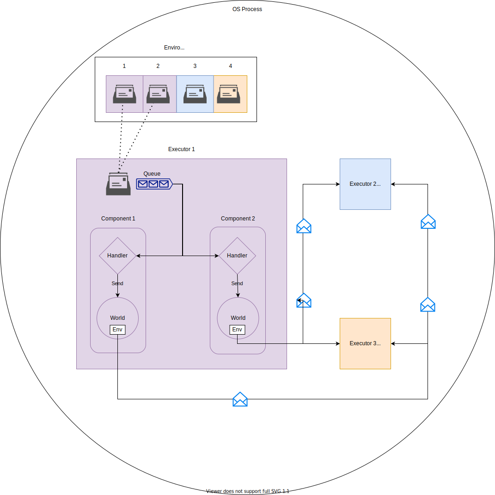
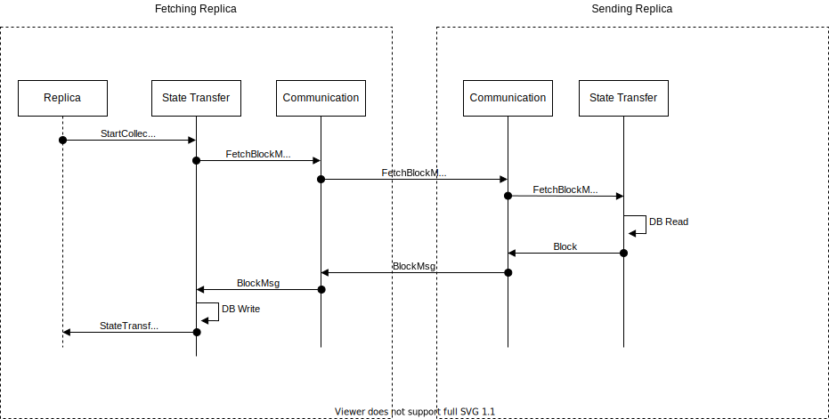
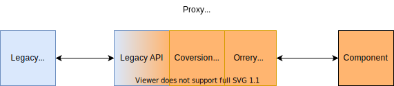
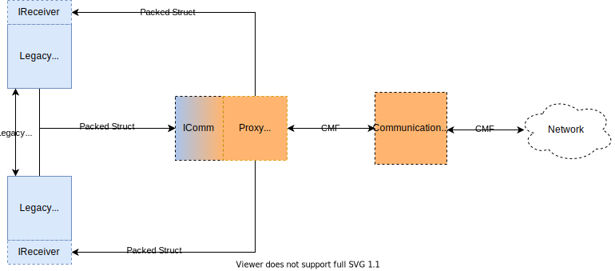
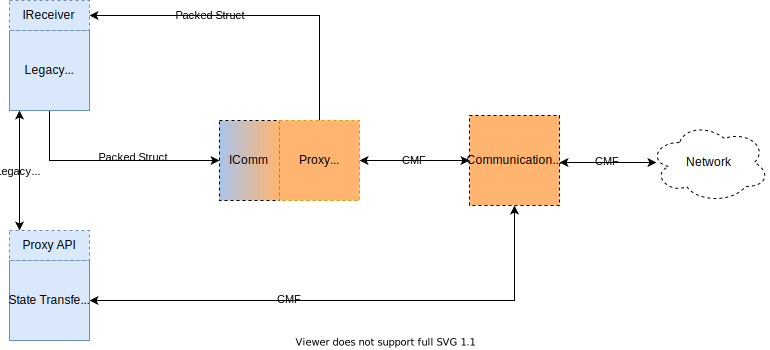

# Introduction

Orrery is a C++ framework that reifies a message passing, component based architecture for concord.
Rather than past attempts at describing an abstract architecture, the overarching design goals for
concord are made concrete with a description of the abstractions and expected usage of orrery.

# Motivation
Like all distributed algorithms, the [sbft](https://arxiv.org/abs/1804.01626) algorithm implemented
in concord is structured around message passing. The main replica thread contains a set of message
handlers that farm work out to other parts of the system, including thread pools for signing and
networking. Responses come back as messages to the main thread. Pre-execution, whereby execution
runs concurrently before consensus, in an optimistic fashion, also relies on messages to communicate
with the main replica thread and other parts of the system.

When originally written, there was no pre-execution, and all storage access was single threaded. Due
to performance pressures and feature additions, much single threaded code was incrementally made
multi-threaded. In many cases this was done through the addition of locks, and in some cases reuse
of existing message passing channels. Ad-hoc changes have further blurred the boundaries between
subsystems making it even harder to debug and add code. Changes are often required in multiple
places, and local reasoning suffers.

Further presenting problems is the fact that messages themselves are encoded as heap allocated
packed structs that often get passed across thread boundaries including queues, computational thread
pools, storage, and networking by casting them to raw `char*`. Low-level functions such as `memcpy`
are littered throughout the code base further obfuscating business logic and complex algorithms, and
leaving the reader of the code unclear as to who owns what data and when its safe to delete.

Compounding issues of ad-hoc locking mechanisms, unclear memory ownership, and mixed levels of
abstraction inside the most critical parts of the code, is the fact that log messages are also
peppered through the system making the code even harder to read. Such a drastic level of logging has
become necessary to track down failures triggered by complex interactions of communicating replicas
occurring over long periods of time in heavily loaded systems.

The architecture and usage patterns introduced by orrery proposes to fix the bulk of these issues via:
 * The use of high level message types based on [CMF](../messages)
 * The organizing of major subsystems into standardized `Components`
 * A standardized mechanism for message passing among components
 * Separation of thread execution from message handlers and their internal state

With such changes, logging and tracing can largely be performed inside the orrery framework or at
the boundaries of code, rather than within core logic. All subsystems and message handling threads
are explicitly enumerated, and components become more easy to test in isolation. Furthermore, the
use of standardized messages and components enables us to consider rewriting components in other
languages such that we can have multiple different compatible replicas with mixed and matched code
interacting so that correlated failures become less of a concern across clusters. This language
independence could also potentially allow parts of the consensus code to be formally verified.
Lastly, the code becomes much more readable, and the structure easier to describe to both new
members of the team and old hats.

# Architectural Values

* Build a modular system
  * Enable local reasoning
  * Create abstractions that do one thing well
  * Isolate technical debt
  * Enable easy discovery of where to add code
  * Make it easier to test subsystems in isolation
  * Make it easier to diagnose and fix bugs
 * Send messages instead of sharing state
 * Be judicious about dependencies
 * Enable writing components and replicas in other languages
 * Enable incremental conversion of current code to the new architecture
   * Stick with and generalize a thread based, message passing architecture

# Assumptions and Limitations

## Coarse grained abstraction
We fully recognize that we are only building a message passing system between coarse grained
components, and as such, we are not limiting the code written inside a component to any specific
paradigm or style. While we encourage small, single-purpose libraries and code reuse, discipline is
still very much required by programmers to "do the right thing". In many cases, code inside
components will continue to use locks or thread pools, and new ones may be added.

We do not view this as a negative though. It allows us to write the majority of our code in standard
C++ style, improving our code base over time, without a wholesale rewrite. This is still a C++ code
base, and we expect the bulk of it to follow standard idioms, as much as they exist in C++. This
coarse grain structuring only constrains the interaction among subsystems and defines the highest
abstraction levels of our code base. This grants individual authors the autonomy they need to be
creative and use the optimal techniques to solve particular problems for a given feature or
subsystem. Orrery does not care if your component heavily uses templates or inheritance, and it
doesn't care if you use futures or condition variables.

## Performance
The purpose of orrery is not to directly enhance performance. While we expect that much excess data
copying can be eliminated due to the use of CMF messages and a straightforward ownership model, we
do not guarantee any massive wins. We do, however, anticipate that a logical and coherent separation
of subsystems will allow us to more easily measure and isolate any bottlenecks.  Furthermore, most
bottlenecks should be more easily reasoned about and fixed locally without crossing component
boundaries.

It is currently unclear whether introduction of more queues will cause problems. We view it as
unlikely as the number of messages passing through the system will generally remain the same. As
stated above, it will also give us more places to measure usage and saturation.

## Back Pressure and Throttling
Orrery currently takes no position on back pressure, rate limiting or capacity. We already limit
messages into the system from the network, and further limit concurrency via consensus settings. We
will continue using this logic for the foreseeable future. Since we also do not want to overly
constrain the communication graph between components, all queues between components internal to a
replica are unbounded. This is done on purpose to avoid any problems caused by distributed
deadlocks. As all internal messages are generated as a result of external messages or timer ticks,
this should not be problematic.

It is likely that we will add a more advanced admission controller for messages received from the
network at some point to limit any possible queue explosion due to malicious senders. As noted
though, we already have a rudimentary form of this and feel it is good enough for now.

# Abstractions

Orrery is based around a unified set of abstractions to enable robust implementation of concord
replicas in C++. Users only implement **components**, which form the high level building blocks of
concord, and **messages** which allow interaction between components. All other abstractions are
provided by orrery and are usable out of the box.

The complete set of abstractions included in an orrery based system is listed below.

 * Component
 * Message
 * Executor
 * Environment
 * Mailbox
 * World

The logical diagram below shows how components interact with each other. An environment contains
references to executor mailboxes. Each mailbox reference is assigned a component ID, shown above it.
Therefore the environment structure maps components to individual executors. Each component also has
access to a world with a reference to an environment embedded in it. This structure allows every
component to interact with every other component via message passing.

Colors indicate the component to executor mapping, with the numbers above the mailboxes in the
environment referencing component IDs.



## Component
A [component](include/orrery/component.h) is the highest level user abstraction in concord.
Components are defined in terms of their message handlers and state. It is also appropriate to
document, in English, the high level behavior of the component and its intention.

Some examples of components are:
 * Consensus (ReplicaImp)
 * State Transfer
 * Reconfiguration Manager
 * Execution Engine
 * Crypto (signing)
 * Communication (networking)

The primary purpose of a component is to encapsulate logic for a subsystem of a concord replica. The
logic for a component should live on a natural boundary in terms of functionality or purpose that is
clear to the builders and users of concord. There are a fixed number of components defined
statically in main. New components can only be added to the system at build time.

Components interact via message passing. The public interface of a component consists of a set of
message handlers. Components must implement `handle(ComponentId from, ConcreteMsg&&)` methods only
for messages they handle, where `ConcreteMsg` is a struct generated from a CMF message. Components
send messages to other components via `Worlds` as shown in the example below.

An [example of a
component](https://github.com/andrewjstone/concord-bft/blob/orrery/orrery/test/orrery_test.cpp#L30-L44)
can be seen in the orrery test code, and is reproduced here for convenience:

```C++
class StateTransferComponent {
 public:
  StateTransferComponent(World&& world) : world_(std::move(world)) {}
  ComponentId id{ComponentId::state_transfer};

  void handle(ComponentId from, StateTransferMsg&& msg) {
    std::cout << "Handling state transfer msg with id: " << msg.id << std::endl;
    st_msgs_received++;
    world_.send(ComponentId::replica, ConsensusMsg{});
  }
  void handle(ComponentId from, ControlMsg&& msg) { control_msgs_received++; }

 private:
  World world_;
};
```

### Rationale
* Why fixed components?
  * Most consensus based systems, including concord, have a concise set of high-level abstractions that remain mostly fixed over the life of the product. Specifying these explicitly, and reifying them as types allows for many of the architectural values related to modularity.
  * Implementation becomes easier and more efficient with a fixed set of components.
  * Glancing at the instantiation point of the system (main) shows exactly which components are in use for a given replica.

* Why message handlers for specific messages only?
  * Components become smaller with less code duplication.
  * It's easy to see what messages a component can handle by glancing at the interface.
  * Unhandled messages can have handlers automatically generated with a standard error reporting mechanism.

### Implementation Details

 A component is actually the `ComponentImpl` template parameter in the [linked implementation](include/orrery/component.h). As described in the next section, only a top-level `Envelope` type is passed between components. However, this variant type is destructured automatically into a specific message that a component can handle. If a component cannot handle a given sub-message an error handler is automatically generated.


## Message

Interestingly, Orrery is *not* a generic framework. It was specifically designed for concord, and this is evident in the choice of messages. Orrery uses [cmf](https://github.com/vmware/concord-bft/tree/master/messages) for messages, and defines a [**global** hierarchy of messages for concord](https://github.com/andrewjstone/concord-bft/blob/orrery/orrery/cmf/orrery_msgs.cmf). For now, this hierarchy is full of stubs, but in practice, it will contain all concord messages under a root type of `AllMsgs`, which contains a `oneof` consisting of a top-level message per component, as well as orrery specific messages:

```
Msg AllMsgs 999 {
    oneof {
        ControlMsg
        ConsensusMsg
        StateTransferMsg
        NetworkMsg
        CryptoMsg
        ExecutionEngineMsg
    } msg
}
```

Note that the first message type in the oneof is a `ControlMsg`. This is an orrery specific message that allows control commands to be dispatched to all components and executors. For now, the sole command is `shutdown`. We plan on using this to retrieve metrics and status as well.

Components receive and send messages. However, the rest of the orrery infrastructure packs these messages into `Envelopes`, so that they can be properly routed to their destinations.

```
Msg Envelope 10000 {
    ComponentId to
    ComponentId from
    AllMsgs all_msgs
}
```

### Rationale
* Why a global hierarchy ?
  * A concord replica is a closed system with a fixed number of components. We know a-priori these components and their corresponding messages, and so we can define them all in a sum type.
  * C++ is a strongly typed language. It's easier and safer to implement message passing where all messages are of a single type.
  * The components themselves do not need to know or care about all messages. They just need to use and handle messages they care about. Therefore, the closed type is not detrimental.

## Executor
Orrery deliberately separates logic and state from threads of execution. You'll notice that in the
discussion of components above, that user code only defines message handlers. Yet, how those
handlers were called, and by whom was left unstated. The job of calling component handlers is
performed  by `Executors`. Components are statically assigned to executors at startup, and executors
are in charge of receiving and forwarding messages to their respective components.

An executor's primary job is to take messages off a queue and call component handlers. In some
cases, executors also must process messages.  For example, executors respond to broadcast control
messages, such as `shutdown`, by calling the handle method of each of their components, and then
returning from their own thread callable.

Executors return a `std::thread` upon a call to `start` and this thread should be joined in main,
along with all other executor threads. This allows for graceful shutdown.

### Rationale
* Why statically assign components to executors?
  * It's much simpler than building a work stealing scheduler.
  * Components are very granular, with relatively stable performance characteristics. Migrating them
   would be overkill. In all cases it should be clear whether a component should live in its own
   Executor or not, or if it is light weight enough to share an executor.
  * We need an incremental mechanism to allow us to immediately start refactoring code. Much of our code is standard threaded C++ and scheduling via some sort of task system would likely backfire.
  * C++ concurrency is still very much a work in progress. In the long-term future we may want to use that internally to a component itself, but it comes with tradeoffs. The [C++ Unified Executors Proposal](http://www.open-std.org/jtc1/sc22/wg21/docs/papers/2020/p0443r12.html) gives a nice declarative interface, but leaves implementation details opaque. Since our code is full of state machines and cryptographic computation, and uses existing libraries such as RocksDB, which is threaded, it's unclear how much value such a thing would have.
  * If we wanted to write code in other languages via the use of proxy components, they would have their own production grade schedulers that we could utilize.

## Mailbox
Each `Executor` has a `Mailbox` associated with it. `Envelopes` destined for any component assigned
to that executor are `put` into a Mailbox. The executor is responsible for distributing the
envelopes to its components.

Mailboxes only provide a public `put` API that allows envelopes to be sent. Only Executors have the "key" to the mailbox and can remove envelopes.

### Rationale
* Why only provide a public `put` API?
  * This gives static, compile time guarantees, that only executors will remove envelopes from mailboxes. This is useful since many parts of the system, running in multiple threads, have copies of a mailbox.
* Why not a queue?
  * The mailbox abstraction hides any underlying mechanism for distribution allowing readers of the code to focus solely on the abstraction of envelope delivery.
* Why a value type?
  * As a mailbox is the primary way for the system to ensure envelope delivery, we want to make sure it can be used safely and cheaply, without worrying about aliasing concerns. Just go ahead and make a copy.

### Implementation Details
A mailbox has a `shared_ptr` wrapping a lock based queue. The queue is created by the executor which
is responsible for pulling envelopes and distributing them to components. This queue may be
suboptimal, but is also easily replaceable inside the Mailbox with any other type of queue or
distribution mechanism. The point is that a queue interface is not exposed at all to the outside
world.

Note further that we don't want to introduce any sort of failure into the Mailbox model. We want to
guarantee that orrery messages internal to the system are always delivered. This eliminates a lot of
unnecessary corner cases. Any possible network operation or other operation where a message can be
dropped should be encapsulated inside a component. A component itself can be responsible for
retries, and the burden is taken off the in-process C++ code.

## Environment
An environment is a thin abstraction that maps components to mailboxes. Its sole purpose is to provide a mechanism for routing envelopes to the proper Executor based on [ComponentId](https://github.com/andrewjstone/concord-bft/blob/orrery/orrery/cmf/orrery_msgs.cmf#L2-L9).

### Implementation Details
ComponentIds are monotonically increasing. This allows efficient access to mailboxes by storing them
in a vector rather than a map.

## World
A `World` is an abstraction that components use to send messages to other components. Components
can only communicate with other components via the use of a world.

### Rationale
* Why have both a `World` and `Environment` abstraction?
  * A world is ergonomic. There is no need to lookup mailboxes or wrap messages into envelopes.
  * Environments are global, whereas worlds are constructed per component. This allows them to automatically wrap the sender id into an envelope.

# Semi-Realistic Example
So far only an abstract model for an orrery based system has been shown. This section will provide
an elided interpretation of what a state transfer component would look like. The sequence diagram
below shows a simplified state transfer flow, where only one block is fetched. It also shows DB
access happening local to the component. However, this could also be farmed out to a **storage**
component.



The pseudo-code below shows an elided version of what state transfer fetching could look like.

```C++
#include <orrery_msgs.cmf.hpp>

namespace concord::orrery {

class StateTransferComponent {
 public:
  // Static configuration elided
  StateTransferComponent(World&& world, DB& db) : world_(std::move(world)), db_(db) {}
  ComponentId id{ComponentId::state_transfer};

  // We can probably get rid of the need to parse variants with a recursive vistior in the component
  // template code In that case we could call handle directly on a StartCollectingStateMsg
  void handle(ComponentId from, StateTransferApiMsg&& msg) {
    ConcordAssertEq(ComponentId::replica, from);
    if (std::holds_alternative<StartCollectingStateMsg>(msg.msg)) {
      auto block_id = db_.getLatestBlockId();
      auto source = getBlockSource();
      // Fetching hashes elided
      world_.send(ComponentId::network, NetworkMsg{source, StateTransferMsg{FetchBlockMsg{block_id}}});
    }
    // ...
  }

  void handle(ComponentId from, StateTransferMsg&& msg) {
    ConcordAssertEq(ComponentId::network, from);
    if (auto msg = std::get_if<BlockMsg>(msg)) {
      // Check for correct block id elided
      if (!verifyHash(hash, data)) {
        // Log error and return
      }
      db_.write(std::move(msg));
      if (stateTransferComplete()) {
        world_.send(ComponentId::replica, ReplicaNotificationsMsg{StateTransferCompleteMsg{true}});
      }
    }
    // ...
  }

 private:
  World world_;
  DB& db_;
};

}  // namespace concord::orrery
```


# Proxy Components

In a sense, most components are "proxy components", in that unless they deal solely with concord business logic or pure computation, they perform IO with the outside world. There are a few very specific cases where this is reflected:
 * Communication between replicas
 * Dealing with an execution engine written in another language (FFI, GRPC, HTTP, etc..)
 * Dealing with an agent for upgrade, status, etc...
 * Database access

These are all fairly obvious and the main point is to wrap any such external usage in a component
such that the behavior is completely encapsulated. However, there is another type of proxy component
that we should focus on for our immediate needs. This is described in the next subsection.

## Incremental Change Via the Use of Proxy Components

One key architectural value is to enable an incremental conversion of the current code base to
orrery. We don't want to rewrite all of our code, and we want to be able to reuse much of it in its
current form. However, we also want to modularize it over time via the introduction of orrery
`Components`.

One straightforward mechanism for achieving our goals is to write proxy components as necessary.
In this case the functionality being encapsulated is the conversion from legacy APIs to the orrery
message passing model.



One particular place where this is immediately useful is our
[communication ](https://github.com/vmware/concord-bft/blob/master/communication/include/communication/ICommunication.hpp)
interfaces. We currently send lots of messages over the network as [packed C
structs](https://github.com/vmware/concord-bft/tree/master/bftengine/src/bftengine/messages). Our
Replica and State Transfer code expect to receive these structs. That code is very tedious to
change due to the low level manipulation and validation of the structs, as well as the complicated
ownership model. However, we want to slowly convert these structs to CMF messages instead and use
CMF messages everywhere. We can enable this conversion by wrapping the communication library into a component, and converting it to handle network related CMF messages that are ports of the existing C structs. The component handler code would then serialize these CMF messages and send them over the network as necessary.

We would then need to create a proxy component implementing the `ICommunication` interface and using
the `IReceiver` interface as a callee. Legacy code would send packed structs via `ICommunication`,
and the proxy component would convert them to CMF messages and forward them to the new communication
component for serialization and transmission over the network. When serialized CMF messages were
received from the network they would be deserialized and forwarded to the proxy component who would
then put them into the original packed structs and dispatch them to the legacy code via the
[IReceiver](https://github.com/vmware/concord-bft/blob/master/communication/include/communication/ICommunication.hpp#L25-L30)
interface.



At this point, we have converted the communication libraries to only deal in CMF messages, but we
haven't yet converted any other system code to use these messages. To do that incrementally we would
create a component that could handle a subset of the messages, like state transfer messages. The
state transfer component would then send messages to the new communication component. The
communication component would also be modified to recognize state transfer messages on network
receipt and send them directly to the state transfer component instead of the proxy component. We
could repeat this process incrementally for different subsets of replica messages and client
messages until eventually all network related messages were dispatched to their proper orrery
components. At this point we could go ahead and remove the proxy component altogether along with the
legacy APIs.

It should be noted that currently the state transfer code and replica code interact via the
[IReplicaForStateTransfer](https://github.com/vmware/concord-bft/blob/master/bftengine/include/bftengine/IStateTransfer.hpp#L78-L94)
and
[IStateTransfer](https://github.com/vmware/concord-bft/blob/master/bftengine/include/bftengine/IStateTransfer.hpp#L24-L74)
interfaces. The end goal is to have the state transfer and replica components only communicate via
messages. We would have two choices here:
 1. Maintain the legacy interfaces as we converted over the replica code to an orrery component, treating the state transfer component as a proxy for the legacy interfaces.
 2. Implement a state transfer proxy component such that the state transfer is entirely complete as an orrery component before we start converting the replica.

 The diagram below shows the incremental step of taking option 1.


